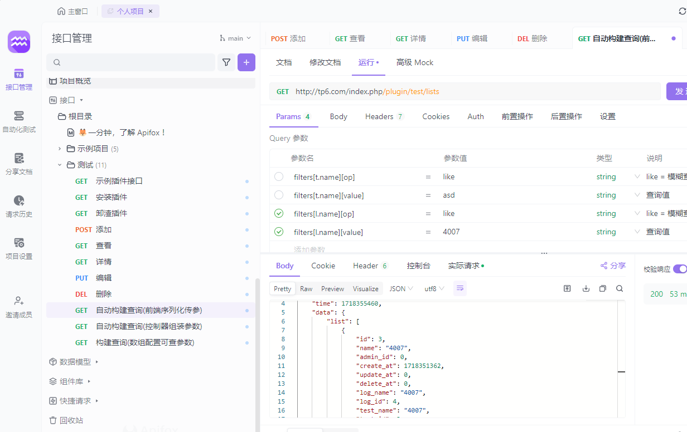

基于 ThinkPHP 6.0 插件式开发
===============

插件目录 plugins
插件路径 app\plugins\插件目录

插件内部已经 实现trait 多态 ,简化增删改查 ，并且自动验证数据
===============
 
目录说明
plugins         插件模块目录
--|Test          插件名称目录

----|controller    插件控制器 

----|dao           插件数据预处理层

----|model         插件模型层

----|services      插件服务层

----|Config.php    插件配置文件

----|Plugin.php    插件统一安装卸载等

----|route.php     插件路由

----|rules.txt     如记录插入路由，等其他安装信息文件

--|PluginTrait.php 多态实现快速增删改查设置
--|PluginTrait.php 多态实现快速增删改查设置
--|PluginQueryBuilder.php 构建快速查询基类

===============

路由定义
Route::rule('plugin/install/[:name]', '\\app\\plugins\\Test\\controller\\Install@install')->method('post,get');//如安装 test 插件模块

Route::rule('plugin/uninstall/[:name]', '\\app\\plugins\\Test\\controller\\Install@uninstall')->method('post,get');//如卸载 test 插件模块

Route::get('plugin/test/hello', '\\app\\plugins\\Test\\controller\\Index@hello');//简单示例路由
// 示例访问插件控制器插件路由

Route::resource('plugin/test', '\\app\\plugins\\Test\\controller\\Index');//请求plugin/test  访问app\plugins\Test\controller\Index 方法

===============
restful 风格请求示例 

===============
构建快速查询，
/plugin/test/lists?filters[t.name][op]=like&filters[t.name][value]=53

/plugin/test/lists?filters[name][op]=eq&filters[name][value]=53

